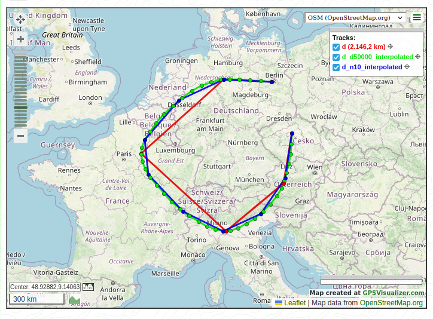

# gpx-interpolate.py

Python script to interpolate GPX files using piecewise cubic Hermite splines.

Interpolates latitude, longitude, elevation and speed at any spatial resolution.

User command line options:

- define total number of the new interpolated track points ; or
- define track points in constant distance steps

Optionally you can define

- constant speed (e. g. 1 m/s); or
- constant time intervals between track points (e.g. define a point every second)
- set (or overwrite existing) start track time (optional) e.g 20240201-120000Z

Output shows

- start and end time based on input parameters
- total track length
- total track travel time based on the given speed or time interval data

## Usage

### Script
```
usage: gpx-interpolate.py [-h] [-d DISTANCE] [-n NUM] [-i INTERVALTIME] [-v VELOCITY] [-s] [-b BEGINTIME] FILE [FILE ...]

interpolate GPX files using piecewise cubic Hermite splines

positional arguments:
  FILE                  GPX file

options:
  -h, --help            show this help message and exit
  -d DISTANCE, --distance DISTANCE
                        set constant distance (interpolation resolution) between track points [m] (default: 1 m)
  -n NUM, --num NUM     force number of track points (default: disabled)
  -i INTERVALTIME, --intervaltime INTERVALTIME
                        set constant time interval [s] between track points
  -v VELOCITY, --velocity VELOCITY
                        set constant velocity [m/s] between track points
  -s, --speed           add speed data to track
  -b BEGINTIME, --begintime BEGINTIME
                        set track begin time UTC [YYYYMMDD-HHMMSSZ]
```

### Module
```python
from gpx-interpolate import gpx_interpolate

gpx_data = {'lat':lat,
            'lon':lon,
            'ele':ele,
            'tstamp':tstamp,
            'tzinfo':tzinfo}

gpx_data_interp = gpx_interpolate(gpx_data, distance=1.0)
```

where:
* `lat`, `lon` are the trackpoints latitude and longitude (in degree)
* `ele` (optional) is the trackpoints elevation (in meter)
* `tstamp` (optional) is the trackpoints timestamps (in second)
* `tzinfo` (optional) is the trackpoints timezone as a `datetime.tzinfo` subclass instance (`None` for UTC)
* `distance` is the interpolation resolution in meters (`1.0` by default, disabled if `num` is passed)
* `num` (optional) is the number of trackpoints of the interpolated data (`None` by default)

`ele`, `tstamp` and `tzinfo` are optional and can be set to `None`.

### Example
:red_circle: input GPX data, :green_circle: interpolated GPX data every 50 km (d=50000) :blue_circle: interpolated GPX data 10 points (n=10)


## Test

Run `./test.sh`

## Requirements

```
gpxpy==1.5.0
scipy==1.8.0
numpy==1.22.2
```
